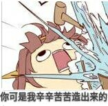

# hushup
Problemset consisting of three rather-simple (?) problems.

除特殊说明外，本仓库内所有内容发布于 [CC BY 4.0 International](https://creativecommons.org/licenses/by/4.0/) 许可证，源码发布于公共领域。

所有表情包版权归原作者所有，osu! 及相关内容均为 (C) ppy, Inc.

RankingWebServer 使用的图标为 Nekoroll 于 Store Art Contest (2012) 中创作的 「circle-count」，在 [CC BY-NC-SA 4.0 International](http://creativecommons.org/licenses/by-nc-sa/4.0/) 许可证下发布。其余作品位于 [osu-artwork](https://github.com/ppy/osu-artwork) 仓库。

## Details

* 大部分绘图使用了 [GeoGebra](http://www.geogebra.org)
* PDF 生成使用了 LaTeX 和 beamer class
* +1s 
* 题目名称来源于 osu! 的三个 Hush-Hush Medals。
* 被覆盖掉的第一题数据们……  

